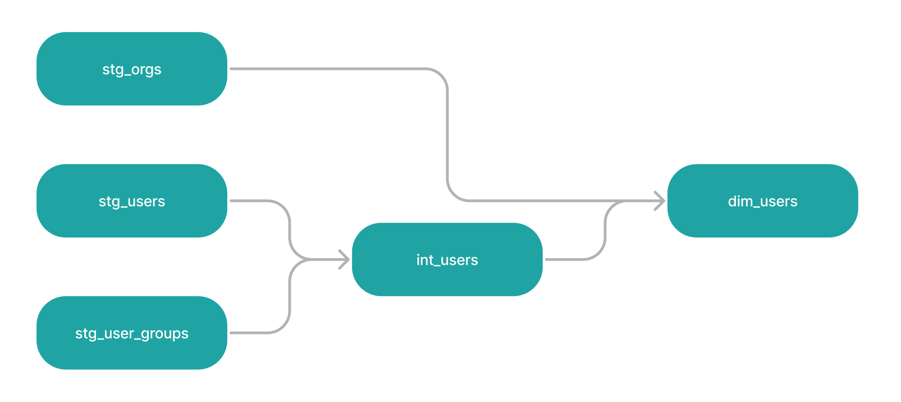

# Data Engineering — Terms

## Data Warehouse
A centralized repository for structured and processed data for querying and analysis (like: **Snowflake**).
  * _Examples_: Storing processed sales data in systems like **Amazon Redshift** and **Google BigQuery**.

## Data Lake 
A storage repository that holds a vast amount of raw data in its native format.
  * _Examples_: Raw log files, image **JSON** data in systems like **Amazon S3**.

## ETL
Extract, Transform, Load, a process that involves extracting data from a source, transforming it into a usable format, and loading it into a destination.
  * _Example_: Extract data from **MySQL**, transform it into a [denormalized](dictionary.md#denormalization) format, and load it into a **Data Warehouse** like **Snowflake**.

## ELT
Extract, Load, Transform, same as **ETL**, but data is first loaded into the target system and then transformed within the target.

* **Data Pipelines** — A series of processes that move data from one place to another, transforming it and loading it into data warehousing systems or other destinations along its way.
  * _Example_: Ingesting raw data from an **API**, transforming it, and loading it into a warehouse.

## 5 Vs
The `5 Vs` refer to the key characteristics of **Big Data**:
  * **Volume**: The massive amount of data generated every second, requiring significant storage and processing power.
  * **Velocity**: The speed at which new data is generated, collected, and processed, often in real-time or near-real-time.
  * **Variety**: The different types of data, including structured, semi-structured, and unstructured data from various sources.
  * **Veracity**: The trustworthiness and quality of the data, addressing issues such as accuracy, consistency, and reliability.
  * **Value**: The potential insights and benefits that can be derived from analyzing the data, turning it into actionable intelligence.
  > These five characteristics are crucial for understanding and managing big data effectively.

## OLTP vs OLAP
  * **OLTP** — Online Transaction Processing systems handle real-time, transaction-oriented tasks like data entry, updates, and quick lookups. They focus on fast, efficient processing of small, frequent operations and use normalized databases to maintain data integrity.
    * _Examples_: **MySQL**, **PostgreSQL**, **MSSQL**.
  * **OLAP** — Online Analytical Processing systems are designed for complex data analysis and reporting, involving large volumes of historical data. They focus on fast querying of large datasets, often using denormalized data structures for efficiency. **OLAP** is typically used for business intelligence and decision-making.
    * _Examples_: **Amazon Redshift**, **Google BigQuery**, **Apache Hive**, **Microsoft Azure Synapse Analytics** (formerly SQL Data Warehouse).

## Pulling Data
Fetching data from a source system or API, typically initiated by the receiving system.
  * _Example_: A data warehouse pulling daily sales data from an e-commerce platform's API.

## Dataset
A dataset is a collection of related data that is typically organized in a structured format, such as a table, file, or database.
  * Each dataset consists of records (rows) and fields (columns) that represent individual data points.
  * What is the difference between **Datasets** and **Data Lakes**?
    * A **Dataset** and **Data Lake** are related concepts in data management, but they serve different purposes and have different scopes.
    * **Dataset** — A specific, structured collection of related data for analysis, e.g., a **.csv file**.
    * **Data Lake** — A large, centralized repository storing raw, diverse data in its native format, e.g., **AWS S3**.
        

## Dag
Is a **D**irected **A**cyclic **G**raph, a type of graph whose nodes are directionally related to each other and don't form a directional closed loop. In data engineering:
  * DAGs are used to represent and manage complex workflows and data pipelines.
  * Each node in a DAG typically represents a task or data transformation step.
  * The directed edges between nodes show the order of execution and data dependencies.
  * Tools like Apache Airflow use DAGs to schedule and orchestrate data workflows.

<!-- TODO

x
In computer science, ACID (Atomicity, Consistency, Isolation, Durability)

b + tree

b - tree

search index vs index?

CAP theorem

base in nosql?

clickhouse vs mongo?

aggregate? aggregation is the process of collecting and summarizing data to

metrics

curd?

cursor

traverse
To traverse an array means to access each element (item) stored in the array so that the data can be checked or used as part of a process

RDBMS
DBMS

accumulate data

unwind

log n

Embedded Data vs Referenced data
-->