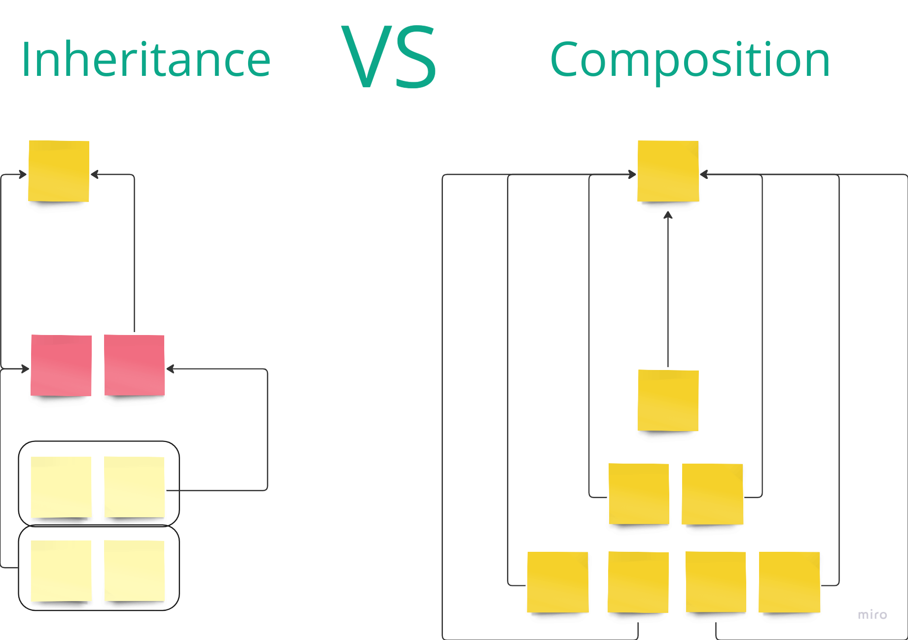
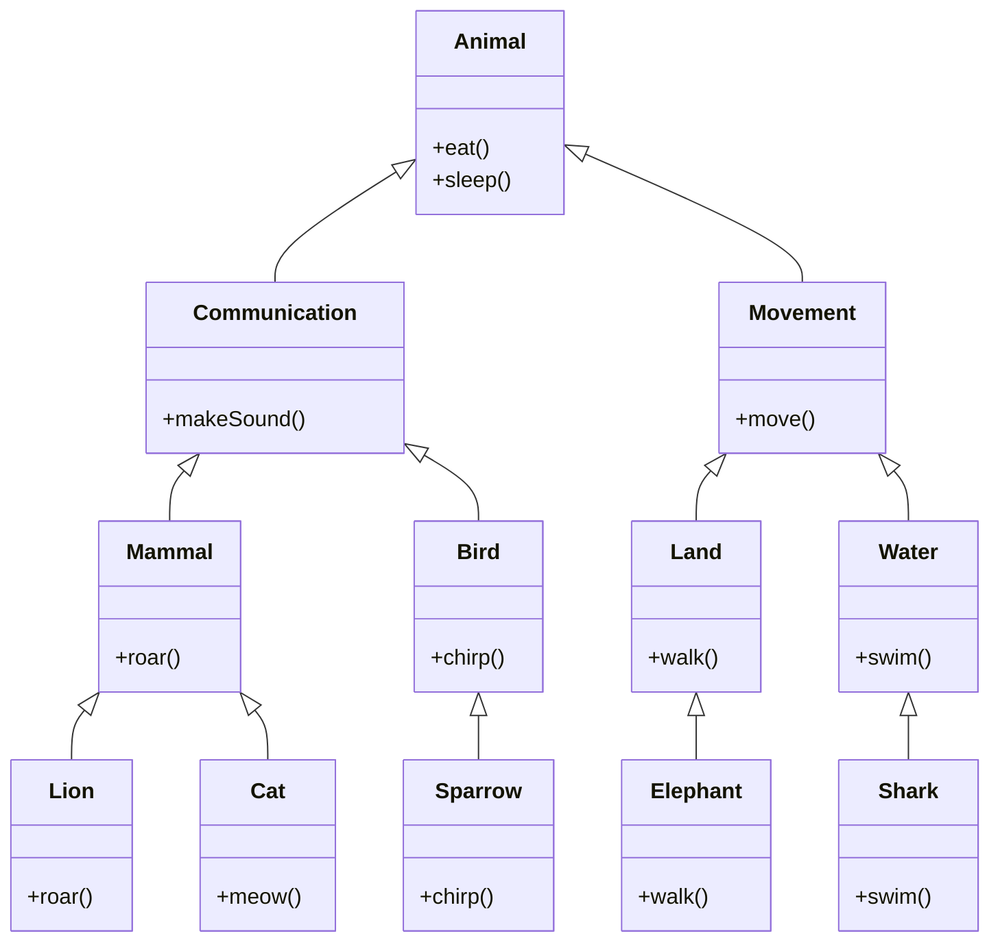
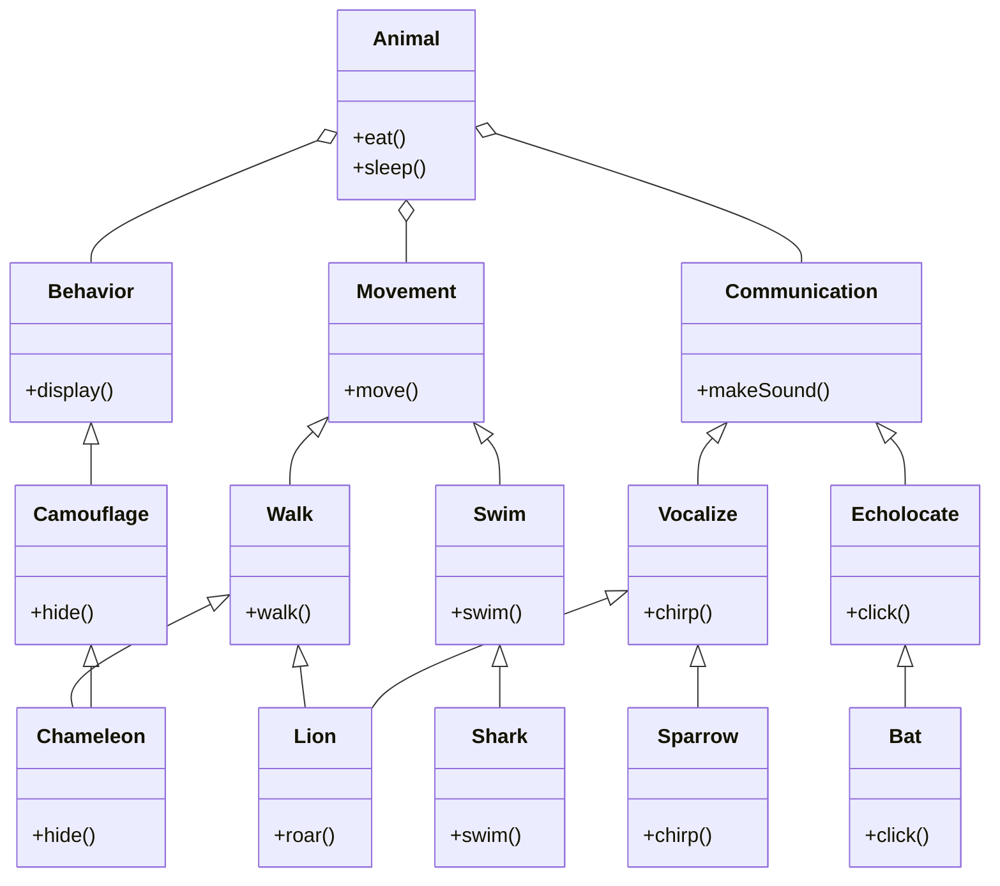

**Composition** and **inheritance** are two fundamental concepts in object-oriented programming (**OOP**) that define how classes can relate to each other. Each has its strengths and is used in different scenarios based on the design needs.

### **Inheritance**
* **What It Is:** Inheritance allows a class (the _child_ or _subclass_) to inherit attributes and methods from another class (the _parent_ or _superclass_).
* **How It Works:** The subclass automatically acquires the properties and behaviors (methods) of the superclass. It can also override or extend these behaviors.
* **When to Use:**
  * When there is a clear `is-a` relationship. For example, if you have a `Bird` class and create a `Sparrow` class, `Sparrow` _is a_ `Bird`.
  * When you want to leverage polymorphism, allowing different types of objects to be treated uniformly through a common superclass interface.
* **Advantages:**
  * Promotes code reuse by inheriting common functionality.
  * Establishes a clear hierarchy and logical structure.
  * Polymorphism through method overriding allows for flexible and dynamic code behavior.
* **Disadvantages:**
  * Can lead to tightly coupled code, making changes in the superclass affect all subclasses.
  * Difficult to adapt or modify without affecting the entire hierarchy.
  * Often results in deep and complex inheritance chains that are hard to manage and understand.

### **Composition**
* **What It Is:** Composition involves building complex types by combining objects of other types. Rather than inheriting behavior, one class contains instances of other classes and delegates work to them.
* **How It Works:** A class is composed of one or more objects from other classes, establishing a `has-a` relationship. For example, a `Car` class might be composed of `Engine`, `Wheel`, and `Seat` objects.
* **When to Use:**
  * When there is a `has-a` relationship. For example, a `Car` _has a_ `Engine`.
  * When you want to build more flexible systems that are easier to modify and extend without altering existing code.
  * When favoring delegation over inheritance, allowing more modular and decoupled designs.
* **Advantages:**
  * Promotes loose coupling, making the system easier to maintain and extend.
  * Enhances flexibility by allowing dynamic composition of objects at runtime.
  * Easier to change behaviors by swapping out components without affecting the entire system.
* **Disadvantages:**
  * Can lead to more complex object management, with potentially many layers of delegation.
  * Sometimes more verbose and less straightforward than inheritance, especially for simple use cases.
  * Requires careful design to ensure that composed objects interact correctly and consistently.

### **Scenario: Animal Communication and Movement**
Animals that can have different communication methods and modes of movement. Inheritance might lead to complexity and rigidity, whereas composition offers a more adaptable solution.

### **Inheritance Example:**



```typescript
// Base class
class Animal {
    eat() {
        console.log("Eating...");
    }
    
    sleep() {
        console.log("Sleeping...");
    }
}

// Derived classes
class Bird extends Animal {
    fly() {
        console.log("Flying...");
    }
}
class Fish extends Animal {
    swim() {
        console.log("Swimming...");
    }
}
class Monkey extends Animal {
    climb() {
        console.log("Climbing...");
    }
}

// Specific animals
class Sparrow extends Bird {
    chirp() {
        console.log("Chirping...");
    }
}
class Shark extends Fish {
    hunt() {
        console.log("Hunting...");
    }
}
class Lion extends Animal {
    roar() {
        console.log("Roaring...");
    }
}

const sparrow = new Sparrow();
sparrow.eat(); // Eating...
sparrow.sleep(); // Sleeping...
sparrow.fly(); // Flying...
sparrow.chirp(); // Chirping...

const shark = new Shark();
shark.eat(); // Eating...
shark.sleep(); // Sleeping...
shark.swim(); // Swimming...
shark.hunt(); // Hunting...

const lion = new Lion();
lion.eat(); // Eating...
lion.sleep(); // Sleeping...
lion.roar(); // Roaring...
```

### Problem with Inheritance
As you can see, we've modeled different animals with specific abilities using inheritance. However, this approach has several limitations:
- **Limited to One Ability**: Each animal class can only inherit from one parent class. This means if you want to model an animal that can both fly and swim (e.g., a flying fish), you can't do this directly with inheritance.
- **Duplicate Code**: If multiple animals share the same abilities but don't fit into the same inheritance hierarchy, you'll need to duplicate code.
- **Rigid Structure**: The inheritance model is rigid. If you later need to add new abilities or modify existing ones, you might need to refactor the entire hierarchy.

### Conclusion
This inheritance approach works well for simple cases but becomes problematic as soon as you need to model animals with multiple abilities or when you need to add new abilities. The rigid structure of inheritance can lead to a less flexible and harder-to-maintain codebase. Next, we'll explore a composition-based approach that provides a more flexible and scalable solution.
## **Composition Example:**

```typescript
// Ability classes
class FlyingAbility {
    fly() {
        console.log("Flying...");
    }
}
class SwimmingAbility {
    swim() {
        console.log("Swimming...");
    }
}
class ClimbingAbility {
    climb() {
        console.log("Climbing...");
    }
}
class RoaringAbility {
    roar() {
        console.log("Roaring...");
    }
}
class ChirpingAbility {
    chirp() {
        console.log("Chirping...");
    }
}
class HuntingAbility {
    hunt() {
        console.log("Hunting...");
    }
}
class CamouflageAbility {
    hide() {
        console.log("Hiding...");
    }
}

// Animal class with composition of abilities
interface Ability {
  [key: string]: () => void;
}
class Animal {
  private abilities: Ability[];
  constructor(...abilities: Ability[]) {
    this.abilities = abilities;
  }
  // Delegate ability methods to composed abilities
  performAbilities() {
    this.abilities.forEach(ability => {
      Object.values(ability).forEach(method => method());
    });
  }
}

// Specific animals
class Sparrow extends Animal {
  constructor() {
    super(new FlyingAbility(), new ChirpingAbility()); // Sparrow can fly and chirp
  }
}
class Shark extends Animal {
  constructor() {
    super(new SwimmingAbility(), new HuntingAbility()); // Shark can swim and hunt
  }
}
class Chameleon extends Animal {
  constructor() {
    super(new ClimbingAbility(), new CamouflageAbility()); // Chameleon can climb and camouflage
  }
}

// Example usage
const sparrow = new Sparrow();
sparrow.performAbilities(); // Flying..., Chirping...
sparrow.chirp(); // Chirping...

const shark = new Shark();
shark.performAbilities(); // Swimming..., Hunting...
shark.hunt(); // Hunting...

const chameleon = new Chameleon();
chameleon.performAbilities(); // Climbing..., Camouflaging...
chameleon.hide(); // Hiding...
```

### Explanation
- **Ability Classes**: Define reusable abilities (`FlyingAbility`, `SwimmingAbility`, `ClimbingAbility`, `RoaringAbility`, `ChirpingAbility`, `HuntingAbility`, `CamouflageAbility`) that can be mixed and matched.
- **Animal Class**: Uses composition to include multiple abilities by aggregating ability instances and delegating method calls to these abilities.
- **Specific Animals**: Combine different abilities as needed for each specific animal.

### Advantages of Composition
- **Flexible Ability Assignment**: Animals can have multiple abilities, and abilities can be easily combined or changed without altering the class hierarchy.
- **Code Reusability**: Ability classe
- **Easy Extension**: New abilities can be added or modified without affecting existing code.

This composition-based approach provides a more flexible and maintainable solution compared to a rigid inheritance hierarchy.

### **Summary:**
* **Inheritance:** Results in a rigid and complex hierarchy that is challenging to extend and manage, particularly when animals have multiple overlapping traits.
* **Composition:** Provides a flexible, maintainable solution for sharing abilities among various animals.modular approach allowing for the easy combination of different abilities and behaviors, accommodating new traits and reducing complexity.